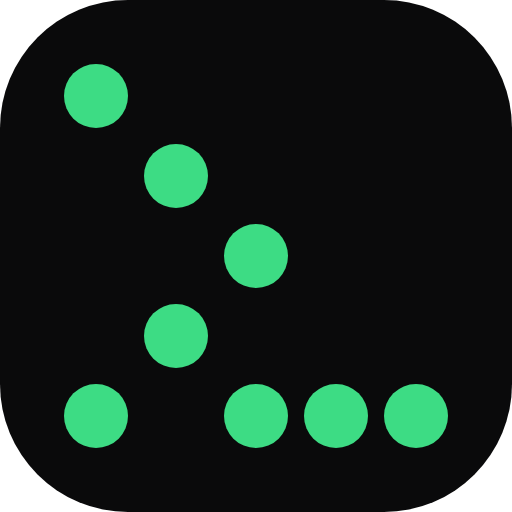
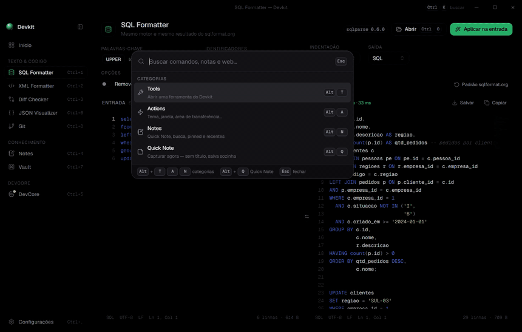
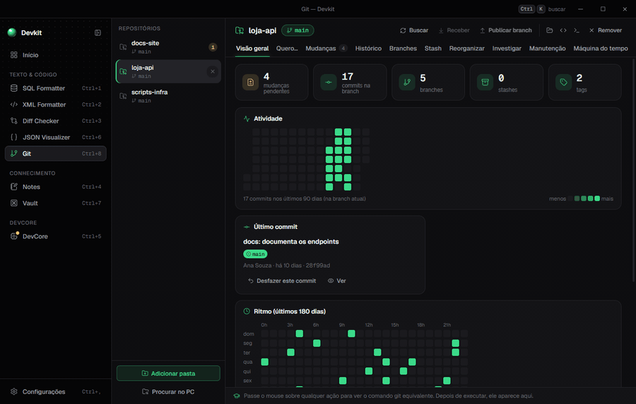
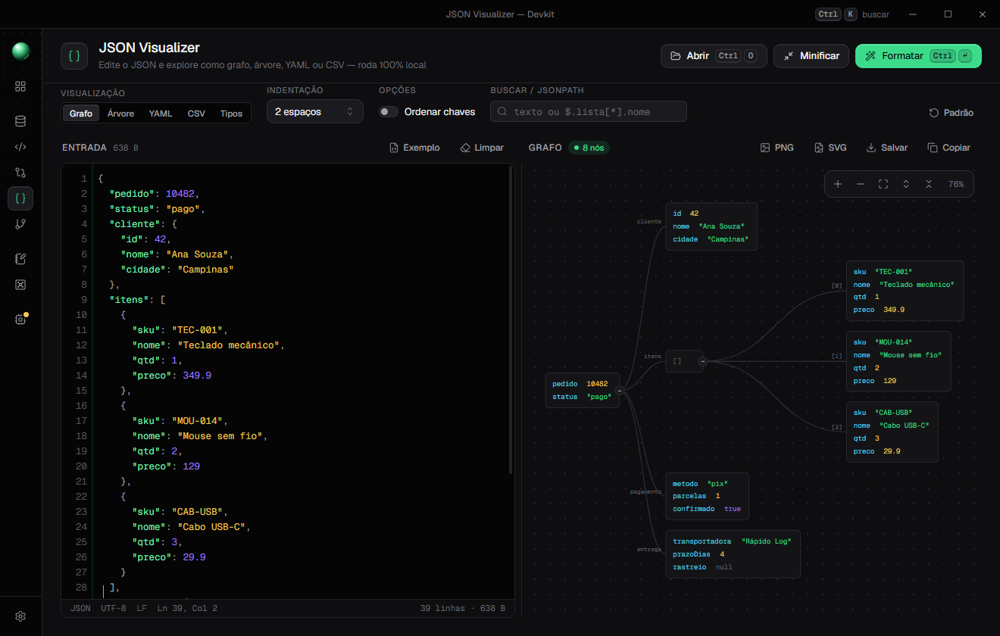
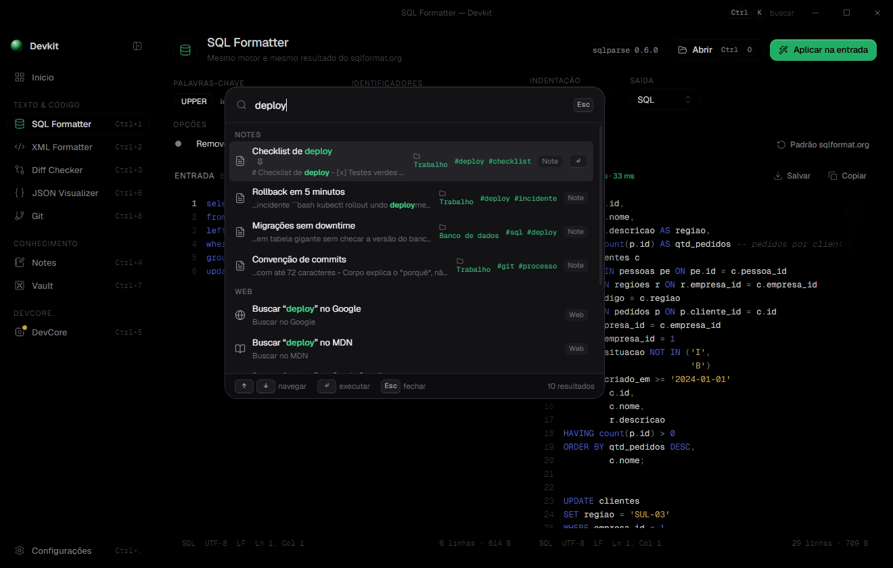
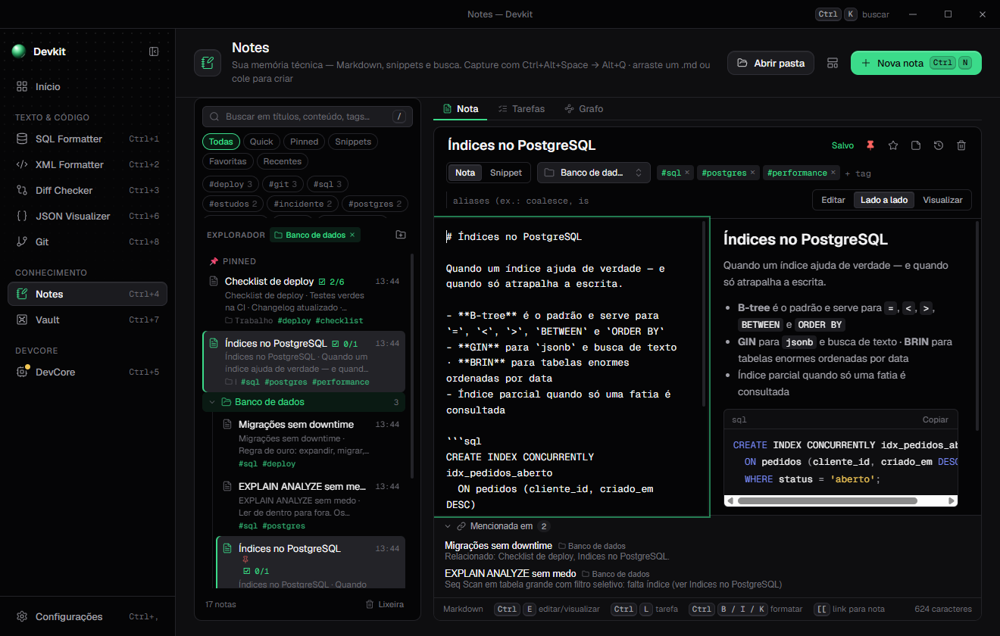
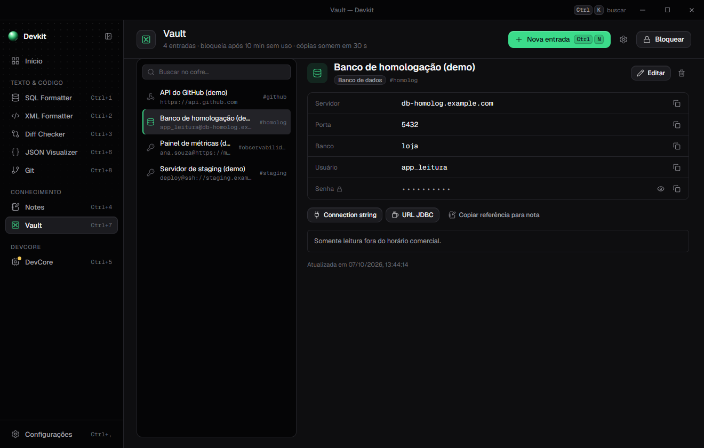
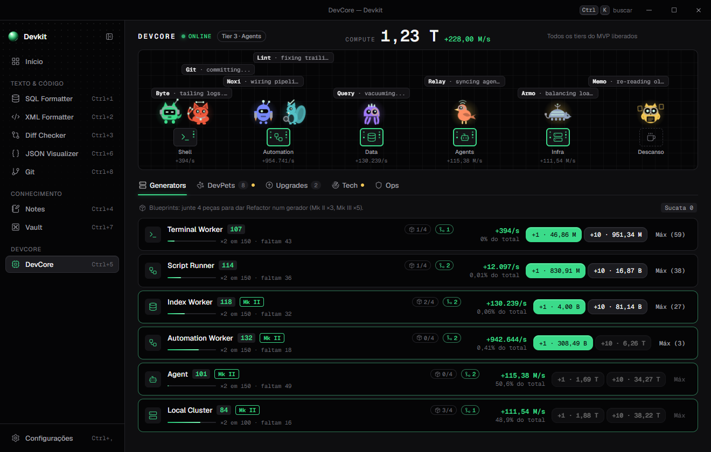

<div align="center">



# Toni Devkit

**Uma caixa de ferramentas offline para o dia a dia de quem programa.**
Formatadores, Git visual, notas, cofre e uma palette global, num app só.

[Baixar](https://github.com/tonissx/toni-devkit/releases/latest) ·
[Guia completo](docs/FEATURES.md) ·
[Licença MIT](LICENSE)



</div>

---

## Por que existe

Todo dia a gente abre um site para formatar um SQL, outro para comparar dois textos, outro para ver um JSON. Cada ferramenta
roda **no seu computador**, sem enviar nada para fora, e todas se alcançam por uma palette (`Ctrl+Alt+Space`) de qualquer
lugar do sistema.

## O que tem dentro

| | Ferramenta | Em uma frase |
| --- | --- | --- |
| 🧮 | **SQL Formatter** | Mesmo motor do sqlformat.org (`sqlparse` em Pyodide), offline, com avisos de risco (`UPDATE` sem `WHERE`…) |
| 🧾 | **XML Formatter** | Formatação nos moldes do vscode-xml, com validação de boa-formação |
| 🔍 | **Diff Checker** | Lado a lado ou unificado, destaque dentro da linha, mesclar bloco a bloco |
| 🕸️ | **JSON Visualizer** | JSON como grafo, árvore, YAML ou CSV; JSONPath; gera tipos TypeScript, C# e JSON Schema |
| 🌿 | **Git** | Interface visual com grafo, stage por trecho, merge com prévia, rebase visual, blame, bisect e **desfazer** |
| 📝 | **Notes** | Markdown com `[[links]]`, tags, grafo, snippets, tarefas e sticky notes |
| 🔐 | **Vault** | Cofre local (AES-256-GCM) com senha mestra e cópia que se apaga |
| 🎮 | **DevCore** | Um jogo idle opcional, com DevPets que você descobre usando o próprio Devkit |
| ✦ | **IA (opcional)** | Desligada por padrão. Local via Ollama ou nuvem via Claude; nada é aplicado sem clique |

## Em destaque

### Git para quem trava nas operações do meio

Rebase, conflito e cherry-pick sem decorar comando. Passar o mouse em qualquer ação mostra o **comando git equivalente**,
e antes de qualquer operação que reescreve histórico ou descarta trabalho o Devkit grava um ponto de volta em
`refs/devkit/backup/…`. **Nada se perde, e tudo tem Desfazer.**



- Grafo do histórico, stage por trecho (o `git add -p` sem decorar nada)
- Merge com **prévia** dos arquivos que vão conflitar
- Editor de conflitos com Meu / Deles / Os dois por bloco
- Rebase interativo por arrastar e soltar
- Blame, busca de quando um texto apareceu, bisect guiado
- Máquina do tempo com o reflog em português

### JSON como grafo



Editor à esquerda e, à direita, o documento como grafo, árvore, YAML ou CSV. Busca por texto ou JSONPath, **Consertar**
(comentários, vírgulas sobrando, aspas simples) e exportação em PNG ou SVG.

### Palette global



`Ctrl+Alt+Space` abre a palette sobre qualquer app, mesmo com o Devkit minimizado. Ela busca em comandos, notas, snippets e
na web. Também tem **Quick Note** (`Alt+Q`), **links rápidos** com alias (`ticket` + `Tab` + `1234` abre o chamado) e
formatação de SQL/XML direto da área de transferência.

### Notes, Vault e DevCore

<table>
  <tr>
    <td width="33%"></td>
    <td width="33%"></td>
    <td width="33%"></td>
  </tr>
  <tr>
    <td align="center"><sub>Notes: memória técnica em Markdown</sub></td>
    <td align="center"><sub>Vault: segredos fora das notas</sub></td>
    <td align="center"><sub>DevCore: o toque de diversão</sub></td>
  </tr>
</table>

## Princípios

- **Offline por padrão.** Sem conta, sem telemetria. A rede só entra quando você liga a IA na nuvem ou checa atualização.
- **Seus dados são arquivos.** Notas são `.md` em `Documentos\Devkit Notes`; o resto fica em `%APPDATA%\Toni Devkit`.
- **O Vault nunca vai para a IA.** Notas seguem com a referência do segredo, nunca com o valor. Notas com a tag `privado`
  também não saem do computador.
- **Nada acontece sem você pedir.** IA, aplicar mudanças e operações destrutivas exigem um clique, e quase tudo desfaz.

## Instalação

**Pronto para usar:** baixe o instalador na [página de releases](https://github.com/tonissx/toni-devkit/releases/latest)
(Windows `.exe`/portable, macOS `.dmg`, Linux `AppImage`).

> O instalador ainda **não é assinado digitalmente**, então o Windows SmartScreen pode mostrar um aviso na primeira vez
> ("Mais informações" → "Executar assim mesmo").

**A partir do código** (Node 20+):

```bash
git clone https://github.com/tonissx/toni-devkit.git
cd toni-devkit
npm install
npm start
```

| Comando | O que faz |
| --- | --- |
| `npm run dev` | Como o `start`, com DevTools abertas |
| `npm test` | Todos os testes, no Node, sem Electron |
| `npm run dist` | Instalador Windows (NSIS) e portable em `dist/` |
| `npm run dist:mac` / `dist:linux` | `.dmg` / AppImage |

## Atalhos principais

| Atalho | Ação |
| --- | --- |
| `Ctrl+Alt+Space` | Abre a palette de qualquer lugar |
| `Ctrl+K` | Palette dentro do app |
| `Ctrl+1` … `Ctrl+8` | Vai direto para a ferramenta |
| `Ctrl+Enter` | Formatar / comparar |
| `Ctrl+,` | Configurações |

## Como é feito

Electron + React, com o renderer compilado por esbuild. Os motores (SQL, XML, Diff, JSON, Git, Notes, Vault, DevCore) são
módulos puros, testados no Node sem abrir janela. O SQL roda `sqlparse` em Pyodide num *worker thread*. A estrutura de
pastas e como adicionar uma ferramenta nova estão no [guia completo](docs/FEATURES.md#estrutura).

## Status

Projeto pessoal em evolução (versão 0.x). Funciona bem no Windows, que é onde é usado e testado; macOS e Linux são
gerados pelo CI, mas têm menos uso. Issues e sugestões são bem-vindos.

## Licença

[MIT](LICENSE) © Antonio Gonçalves. Os componentes de terceiros estão em [THIRD-PARTY-NOTICES.md](THIRD-PARTY-NOTICES.md).
